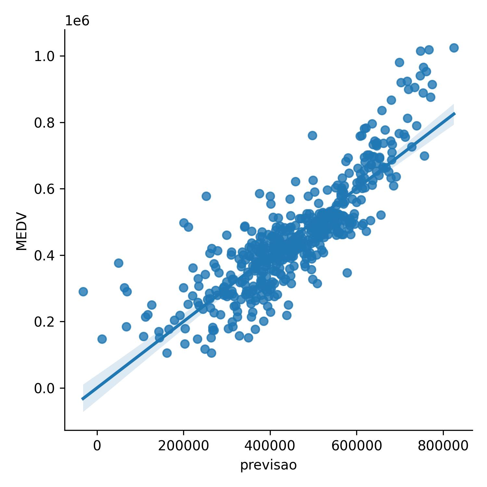

## Algoritmos de regressão 
**Objetivo**: Está implementação visa aplicar e avaliar diferentes algoritmos de Machine Learning  para a determinação do preço medio de venda de um imóvel para a cidade de Boston,a partir da base de dados *BostonHousing*.
## Algoritmos regressivos aplicados
* Regressão linear simples
* Resessão linear multipla
* Regressão polinomial
* Support Vector Regression (SVR)
*  DecisionTreeRegressor
* RandomForestRegressor
* XGBoost Regression
* LGBMRegressor
### Etapas de desenvolvimento do projeto
1. Analise exploratoria de dados.
2. Aplicação da regressão linar simples
3. Aplicação da regressão linear multipla
4. Aplicação dos regressão polinomial 
5. Aplicação dos algritmos de regressão classivos.
6. Validação dos resulatdos obtido.

## 1. **Analise exploratoria de dados**
1.1 **Detecção de outliers**

1.2 **Mapeamento de correlações**

1.3 **Teste de normalidade**

1.4 **Heatmap**

## 2. Regressão linear simples (RLS)
2.1  **RLS -Valores de teste - RMxR\$**

2.2  **RLS -Valores de treino - RMxR\$**

2.3  **RLS -Valores de teste - LSTATxR\$**

2.4  **RLS -Valores de treino - LSTATxR\$**

2.4  **Avaliação homoscedasticidade**

2.4  **RLS -Statsmodel**

## 3. Regressão Linear Multipla (RLM)
3.1 **Distribuição Acurracy**

## 3. Regressão Linear Multipla (Statsmodel)
3.1 **Normal_QQ_plot_redisuos_stats**

3.2 **Homocedasticidade -Statsmodel**

3.3 **Regressivo-Statsmodel**

4 **Regressão polinomial (RP)**
4.1 **RP-teste**

4.1 **RP-teste**

5 **Resultados Regressores**

